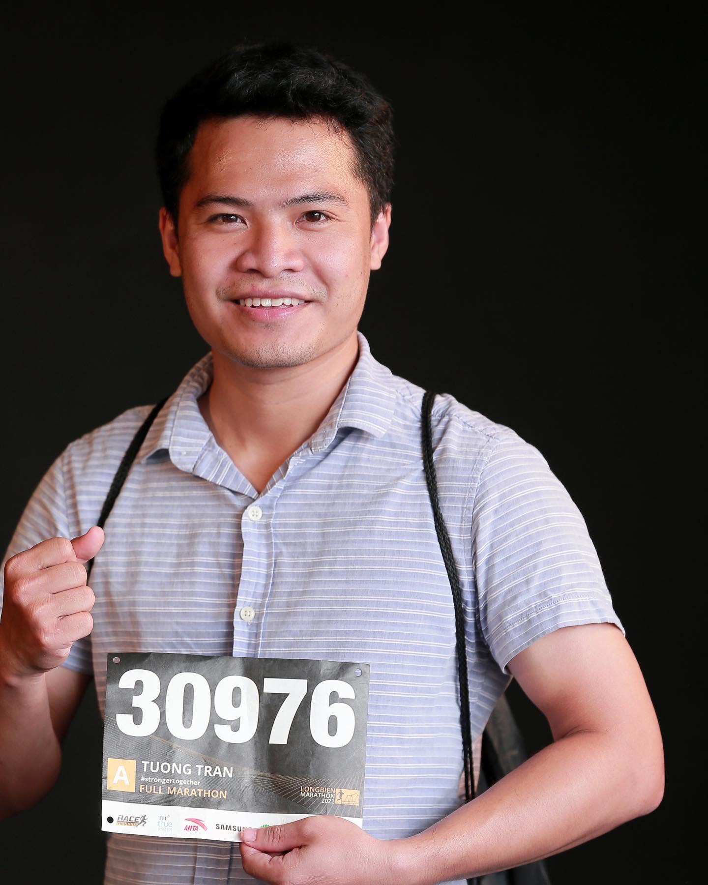

<figure>
  
  <figcaption>Tuong Tran at Long Bien Marathon in 2022</figcaption>
</figure>

## About me
I am an AI Engineer in the field of machine learning with a focus on computer vision. My research interests include the foundations of algorithms and their real-world applications.
+ **Object Detection/Segmentation/Pose Estimation**
+ **Optical Character Recognition (OCR)**
+ **Very-rich Document Understanding & Layout Analysis**

I have a background in mathematics and informatics, having graduated from Ha Noi University of Science and Technology (HUST). Since then, I have been deeply engaged in artificial intelligence, constantly expanding my knowledge through work experience.

My professional experience began at [VNPT-AI](https://icenter.ai/vi), where I developed computer vision-based algorithm optimization for VNPT Smart Vision, such as warning detection, and action object identification. After then, I worked on Document Understanding and Layout Analysis at [Eastgate-SoftWare](https://eastgate-software.com/).
